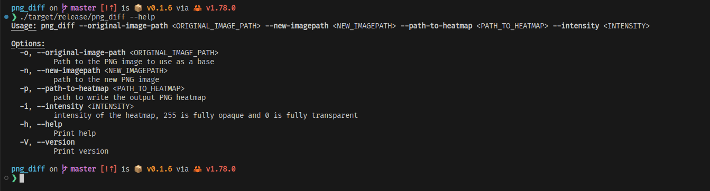

# png_diff 

A simple rust binary to generate the difference between two pngs of the same size as a heatmap

## Usage

## Dev Notes
- The current implementation of the program calculates the heatmap using a single thread. My reasoning is that you would ideally spawn a new process whenever required